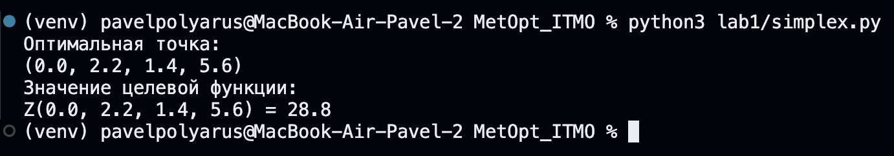
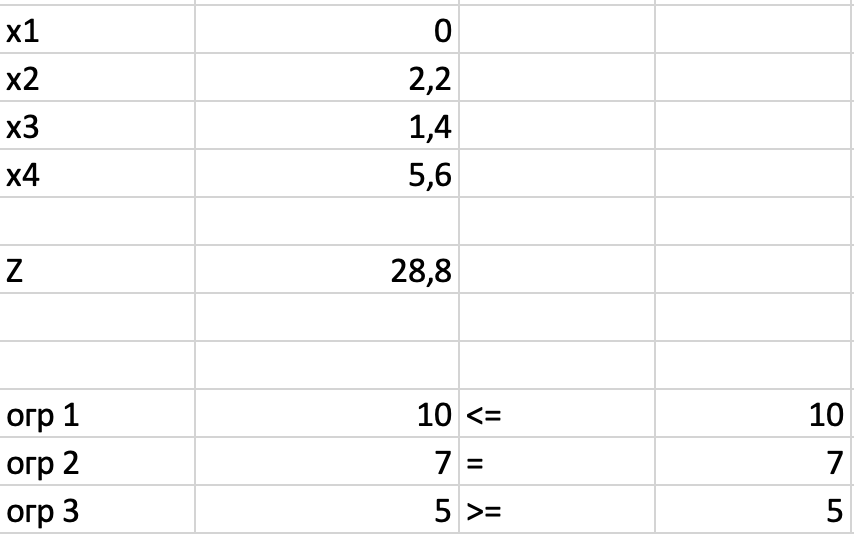

# Отчет по заданию 1
## Решение задачи линейного программирования симплекс-методом

Студент Полярус Павел Анатольевич 

ИСУ - 409371

Поток 1.2
## 1. Краткое описание алгоритма решения ЗЛП

Реализован **двухфазный симплекс-метод** для решения задач линейного программирования.

### Псевдокод алгоритма:

```
АЛГОРИТМ SimplexMethod(c, A, signs, b)
ВХОД: 
  - c: вектор коэффициентов целевой функции
  - A: матрица коэффициентов ограничений
  - signs: знаки неравенств/равенств
  - b: правые части ограничений

ВЫХОД: оптимальное решение x* и значение Z*

НАЧАЛО
  1. ПРИВЕДЕНИЕ К КАНОНИЧЕСКОМУ ВИДУ
     ДЛЯ каждого ограничения i:
       ЕСЛИ signs[i] == "<=" ТОГДА
         добавить slack-переменную s_i
         базис[i] = s_i
       ИНАЧЕ ЕСЛИ signs[i] == ">=" ТОГДА
         добавить slack-переменную -s_i
         добавить искусственную переменную a_i
         базис[i] = a_i
       ИНАЧЕ ЕСЛИ signs[i] == "=" ТОГДА
         добавить искусственную переменную a_i
         базис[i] = a_i
     КОНЕЦ ДЛЯ
     
  2. ФАЗА I (поиск допустимого базисного решения)
     Сформировать вспомогательную задачу:
       минимизировать F1 = Σ(искусственных переменных)
     
     Построить симплекс-таблицу T1
     
     ДЛЯ каждой базисной переменной:
       обнулить её коэффициент в целевой строке
     
     ВЫПОЛНИТЬ SimplexIteration(T1, базис)
     
     ЕСЛИ F1 > ε ТОГДА
       ВЕРНУТЬ "Допустимых решений нет"
     
  3. ФАЗА II (решение основной задачи)
     Удалить все искусственные переменные из таблицы
     Заменить целевую строку на исходную функцию F2 = -c^T·x
     
     ДЛЯ каждой базисной переменной:
       обнулить её коэффициент в целевой строке
     
     ВЫПОЛНИТЬ SimplexIteration(T2, базис)
     
  4. ИЗВЛЕЧЕНИЕ РЕШЕНИЯ
     ДЛЯ каждой переменной x_j:
       ЕСЛИ x_j в базисе ТОГДА
         x_j = значение из соответствующей строки
       ИНАЧЕ
         x_j = 0
     
     Z* = значение целевой функции из последней строки
     
     ВЕРНУТЬ (x*, Z*)
КОНЕЦ

ПРОЦЕДУРА SimplexIteration(T, базис)
  ПОКА существуют отрицательные коэффициенты в целевой строке:
    1. Выбрать разрешающий столбец (минимальный отрицательный коэффициент)
    
    2. Вычислить симплексные отношения:
       ratio[i] = b[i] / a[i,col] для a[i,col] > 0
    
    3. ЕСЛИ все ratio[i] == ∞ ТОГДА
         ВЕРНУТЬ "Целевая функция не ограничена"
    
    4. Выбрать разрешающую строку (минимальное отношение)
    
    5. Обновить базис: базис[row] = col
    
    6. Выполнить шаг Жордана-Гаусса:
       - Разделить разрешающую строку на разрешающий элемент
       - Обнулить остальные элементы разрешающего столбца
  КОНЕЦ ПОКА
КОНЕЦ ПРОЦЕДУРЫ
```

### Основные этапы:

1. **Канонизация** — преобразование ограничений к стандартному виду с добавлением slack и искусственных переменных
2. **Фаза I** — поиск начального допустимого базисного решения путем минимизации суммы искусственных переменных
3. **Фаза II** — оптимизация исходной целевой функции от найденного допустимого решения
4. **Итерации симплекс-метода** — последовательное улучшение решения через выбор разрешающих элементов и преобразования Жордана-Гаусса

---

## 2. Инструкция по развертыванию и запуску программы

### Требования:
- Python 3.7+
- NumPy

### Установка зависимостей:

```bash
pip install numpy
```

### Формат входного файла `task.txt`:

**Пример для данной задачи:**

```
max 2 1 3 4
1 2 0 1 <= 10
1 0 1 1 = 7
0 1 2 0 >= 5
```

### Запуск программы:

```bash
cd project
python lab1/simplex.py
```

## 3. Демонстрация работы программы

### Вариант задания:

**Максимизировать:** Z = 2x₁ + x₂ + 3x₃ + 4x₄

**При ограничениях:**
- x₁ + 2x₂ + x₄ ≤ 10
- x₁ + x₃ + x₄ = 7
- x₂ + 2x₃ ≥ 5

### Результаты работы программы:

```
Оптимальная точка:
(0.0, 2.2, 1.4, 5.6)

Значение целевой функции:
Z(0.0, 2.2, 1.4, 5.6) = 28.8
```


### Сравнение с MS Excel:

Результаты, полученные с помощью надстройки "Поиск решения" в MS Excel, показывают идентичные значения:
- Оптимальная точка совпадает
- Значение целевой функции совпадает

## 4. Рефлективный вывод
Работа оказалась очень полезной для понимания внутреннего устройства методов оптимизации, именно ручками с нуля писать всю реализацию позволило досконально изучить работу алгоритма. Кроме этого получил практический опыт работы с матрицами и векторами, напомнио себе как работать с массивами в Python.
